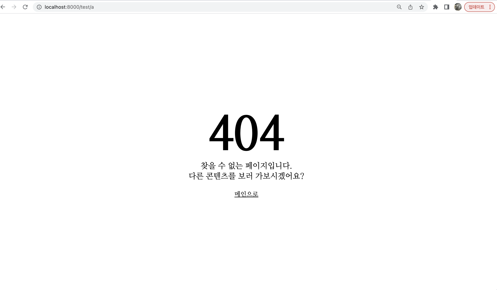
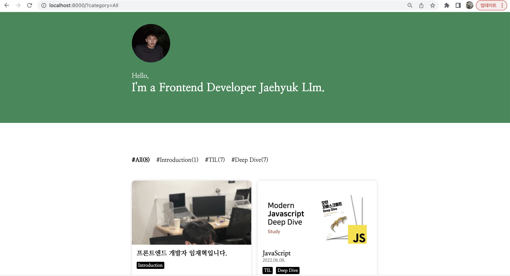
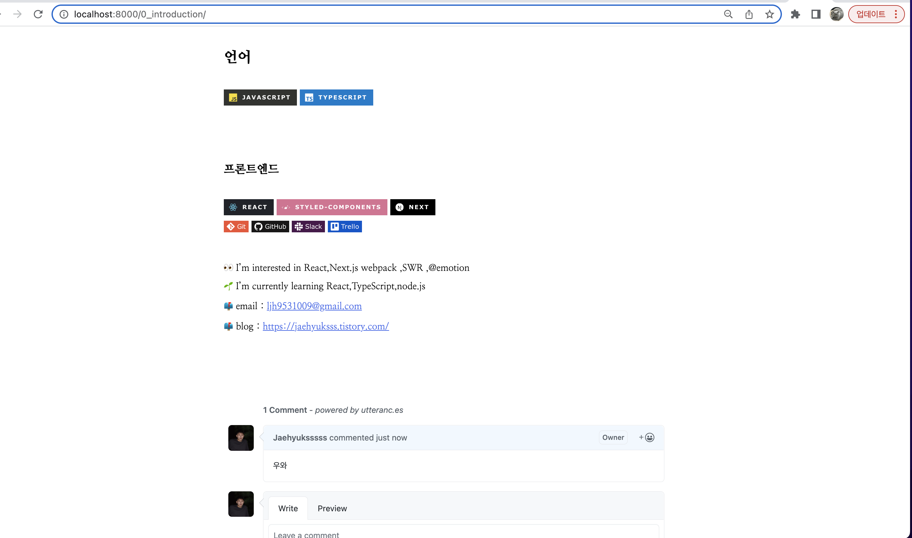
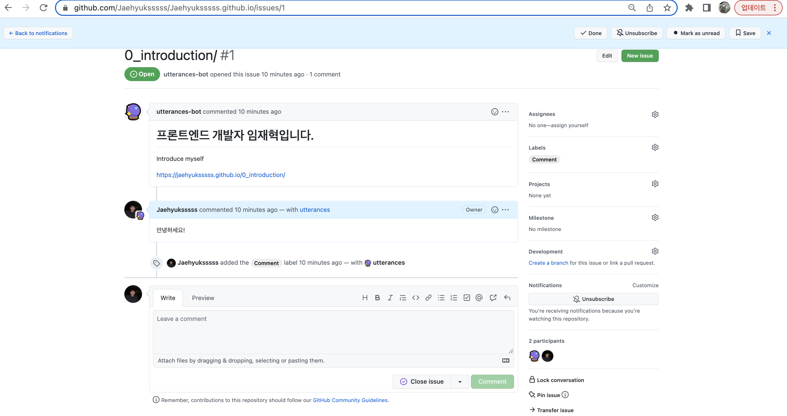

# my-Gatsby-blog

## 리액트 정적 프레임워크인 Gatsby를 사용하여 자기소개 블로그를 만들기
블로그 주소 : https://jaehyuksssss.github.io/
---

## Technologies
* Git, github
* 기술 스택 : TypeScript , React , Gatsby , GraphQL, @emotion 
---

### 구현 기능
1. 반응형 디자인, 인피니티 스크롤 구현, 404 페이지 커스텀

- **반응형 디자인** : 각각 profile Image, Introduction 컴포넌트, CategoryList 컴포넌트, PostList 컴포넌트, Footer 컴포넌트에 일반적으로 사용되는 태블릿 너비인 768px에 맞춰서
  미디어 쿼리를 통해 반응형 디자인을 구현.

- **인피니티 스크롤 구현** : 카테고리 별로 아이템을 필터링 해줌과 동시에 인피니티 스크롤 기능까지 제공하는 useInfiniteScroll 커스텀 훅을 통해 구현. (특정 요소가 화면에 보일 경우, 다음 데이터를 로드하는 방식)

- **404 페이지 커스텀** : src/pages 디렉토리에 404라는 이름의 컴포넌트 파일을 생성하여 커스텀

### 2. 메인 페이지 
- 간단한 소개 부분 , 카테고리 부분 , 프로필 이미지 부분으로 구성
- 필터 기능을 통해서 원하는 카테고리의 포스트에 들어 갈 수 있음

### 3. 포스트 
- GraphQL을 통해 Markdown 정보 쿼리하기
- 상단 배경 안에 게시글 제목, 카테고리, 날짜가 보이도록 구현
 

- github Utterances 위젯을 통해 댓글을 달면 해당 repo issue에 댓글이 달릴 수 있게 함

---

