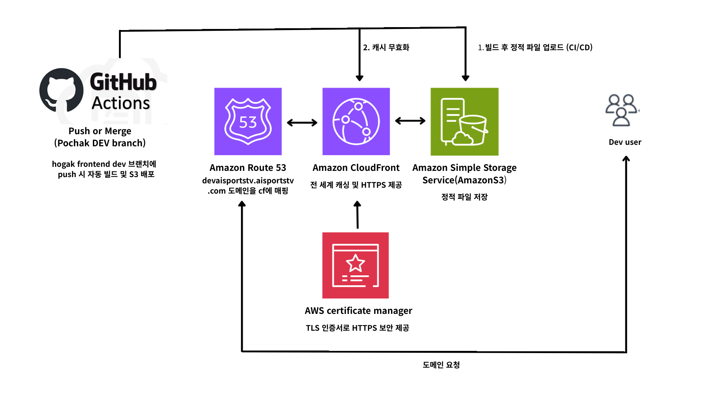

# 개요

기존 서비스의 prod, stage 환경은 aws codepipline -> s3 -> ec2(nginx)로 구축이 되어 있었고 dev브랜치는 따로 ci/cd 구축이 되어있지 않아서 POC 겸 마이그레이션을 진행했습니다.

## 1. Architecture



### 아키텍쳐 설명

#### 전체 흐름 (DEV)
1. **개발자가 dev 브랜치에 Push/Merge**
2. **GitHub Actions 트리거** → 빌드 & 테스트 실행
3. **정적 파일 배포**
   - 빌드 결과물 `build/` → S3 버킷(정적 웹 호스팅 전용)으로 업로드
4. **캐시 무효화**
   - 새 빌드 반영을 위해 CloudFront 캐시 Invalidation 요청 수행
5. **도메인 연결**
   - Route 53이 `devaisportstv.aisportstv.com` 요청을 CloudFront 배포로 라우팅
6. **HTTPS 보안**
   - AWS Certificate Manager(ACM)의 TLS 인증서를 CloudFront에 연결 → 전 구간 HTTPS 제공

#### 사용자 접근 경로
```
Dev User → devaisportstv.aisportstv.com → Route 53 → CloudFront(캐싱) → S3(원본)
```

#### 구성 요소 역할

**GitHub Actions**
- CI/CD 파이프라인: `npm ci` → `npm run build` → `aws s3 sync` → `cloudfront invalidation`

**Amazon S3**
- 빌드 결과 정적 파일 저장(원본 Origin)
- OAC(Origin Access Control) 또는 OAI로 직접 접근 차단, CloudFront 경유만 허용

**Amazon CloudFront**
- 글로벌 캐싱 & HTTPS, 정적 자산 고속 배포
- 배포 후 Invalidation으로 즉시 반영

**Amazon Route 53**
- `devaisportstv.aisportstv.com` → CloudFront 배포에 ALIAS 레코드 연결

**AWS Certificate Manager (ACM)**
- `devaisportstv.aisportstv.com` 도메인 인증서 발급(리전: us-east-1)
- CloudFront에 연결하여 HTTPS 적용

