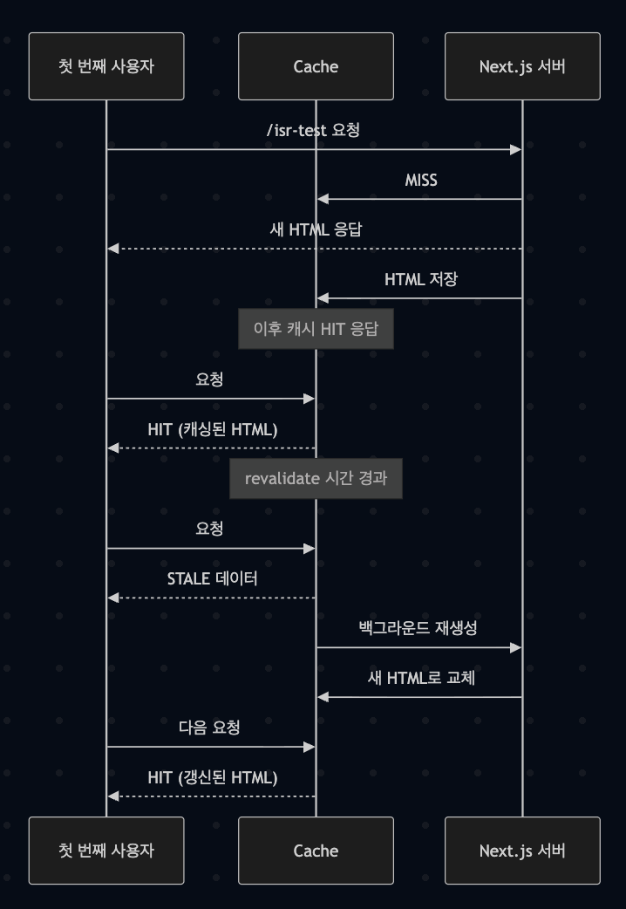

# Next.js ISR 학습기

## 1. 들어가며

ISR을 학습하는 과정을 기록한 글입니다.

## 2. SSR과 ISR 개념 정리

### 2.1 SSR(Server-Side Rendering)

#### 2.1.1 왜 스파이크에 취약한가
SSR은 요청마다 다음 과정을 수행합니다: 라우팅 매칭 → 데이터 패칭(fetch) → 서버 컴포넌트 렌더링(RSC/HTML 생성) → 직렬화/압축 → 전송

이벤트성 페이지나 푸시/뉴스레터 발송 직후처럼 특정 시점에 접속이 몰리면, 모든 요청에 대해 서버가 매번 HTML을 새로 생성해야 합니다.
→ 요청이 폭증할수록 동시 렌더링 작업이 급격히 늘어 서버 부하가 커지고, TTFB(첫 바이트 수신 시간)가 지연됩니다.

#### 2.1.2 서버 부하 문제
SSR은 CSR과 달리 정적 파일을 바로 내려주는 대신, 요청마다 데이터 패칭과 React 렌더링을 거쳐 HTML을 생성합니다.
→ 단순 파일 I/O가 아니라 CPU 연산과 메모리 사용이 반복되어 서버 자원이 빠르게 소모됩니다.

비용과 장애 위험
트래픽이 몰릴 때 SSR을 그대로 유지하면 사실상 스케일 아웃(인스턴스 증설) 외엔 대응 수단이 제한적입니다.
→ 인스턴스가 늘수록 인프라 비용이 증가하고, 오토스케일링이 제때 반응하지 못하면 순간 과부하로 장애로 이어질 수 있습니다.

### 2.2 ISR(Incremental Static Regeneration)

#### 2.2.1 동작 방식
기본은 정적 페이지처럼 캐싱된 HTML을 반환합니다.
→ 설정한 revalidate 시간이 지나면 첫 요청에서 STALE 응답을 그대로 제공하면서, 백그라운드에서 새 HTML을 생성합니다. 생성이 끝나면 캐시를 교체하고 이후 요청부터 최신 HTML을 제공합니다.

#### 2.2.2 장점
SSR의 유연성과 SSG의 성능을 결합해 TTFB를 안정적으로 유지합니다.
→ 트래픽 스파이크 시에도 대부분 캐시에서 바로 응답하므로 서버 렌더링 부담이 크게 줄어듭니다.

#### 2.2.3 설계 포인트
revalidate는 허용 가능한 최대 데이터 신선도 지연(최대 staleness)을 의미합니다.
→ 자주 바뀌는 데이터는 주기를 짧게 두고, 중요한 변경은 온디맨드 무효화(revalidatePath/revalidateTag)와 병행합니다. 실시간성이 꼭 필요하면 no-store로 SSR, 완전 정적은 force-cache를 고려합니다.

```typescript
// app/posts/[id]/page.tsx
export const revalidate = 60;

export default async function Page({ params }) {
  const data = await fetch(`https://api.example.com/posts/${params.id}`, {
    next: { revalidate: 60 },
  }).then(r => r.json());

  return <PostDetail data={data} />;
}
```

## 3. ISR 동작 확인하기

### 3.1 테스트 환경

- Next.js 14, App Router 기반
- `next build && next start` 실행
- ※ 개발 모드(next dev)에서는 ISR 캐싱과 재검증이 동작하지 않습니다.

### 3.2 실험 과정


**첫 요청**
- 응답 헤더: `X-Nextjs-Cache: MISS`
- 서버가 새 HTML을 렌더링하고 캐시에 저장

**두 번째 요청 (캐시 유효)**
- 응답 헤더: `X-Nextjs-Cache: HIT`
- 캐시에 저장된 HTML을 그대로 반환 → 매우 빠른 응답

**Revalidate 시간이 지난 후 첫 요청**
- 응답 헤더: `X-Nextjs-Cache: STALE`
- 사용자는 캐시된 데이터(STALE)를 받음
- 동시에 백그라운드에서 새로운 HTML이 생성

**그다음 요청**
- 응답 헤더: `X-Nextjs-Cache: HIT`
- 갱신된 HTML이 반환


#### 3.2.1 실험 코드 예시

```typescript
// app/isr-test/page.tsx
export const revalidate = 60;
export default async function Page() {
  return <pre>{new Date().toISOString()}</pre>;
}
```

#### 3.2.2 헤더 확인 방법

터미널에서 캐시 상태 확인:
```bash
curl -s -D - -o /dev/null http://localhost:3000/isr-test | grep -i X-Nextjs-Cache
```

브라우저 DevTools에서 확인:
1. Network 탭 열기
2. 페이지 새로고침
3. 요청 선택 후 Headers에서 `X-Nextjs-Cache` 값 확인
4. "Disable cache" 옵션을 켜고 새로고침하면 MISS/HIT/STALE 흐름이 더 명확하게 보임' 


### 4.1 캐시 일관성 문제

PM2 클러스터처럼 여러 인스턴스에서 애플리케이션을 실행하면, 인메모리 캐시가 분리됩니다.

- 특정 인스턴스는 최신 데이터를 가지고 있어도 다른 인스턴스는 STALE로 판정 → 불필요한 재생성

* 해결책: Redis 같은 외부 캐시 도입**
- 여러 인스턴스가 동일한 캐시를 참조해 일관성 유지

### 4.2 캐시 무효화 전략

**시간 기반(Time-based)**: 일정 주기로 자동 재검증

**온디맨드(On-demand)**: CMS 수정 시 `revalidatePath` 호출

* 온디맨드 방식은 실시간 반영이 가능하지만, Thunder Herd 문제(다수의 MISS 요청이 몰려 서버 부하 발생)가 생길 수 있어, Prefetch 로직 같은 보완이 필요함**

## 5. 내가 얻은 인사이트

1. **이론만으로는 이해가 한계가 있었다.** 직접 실험하면서 HIT → STALE → 재생성 과정을 눈으로 확인하니 ISR이 훨씬 명확해졌다.

2. **실무에서는 더 복잡한 고려사항이 필요하다.** Redis, Nginx, Prefetch 같은 운영 전략은 작은 프로젝트에서는 체감하기 어렵지만, 사례 분석을 통해 왜 필요한지 알게 되었다.

3. **ISR은 단순히 revalidate 값을 넣는 게 아니라, 서비스 특성과 트래픽 패턴에 맞는 캐싱 전략을 설계하는 기술이라는 점을 깨달았다.**


---

> 이 글은 Next.js ISR에 대한 개인적인 학습 과정을 정리한 내용입니다. 덧붙일 내용이 있으면 댓글 달아주셔도 감사하겠습니다.
