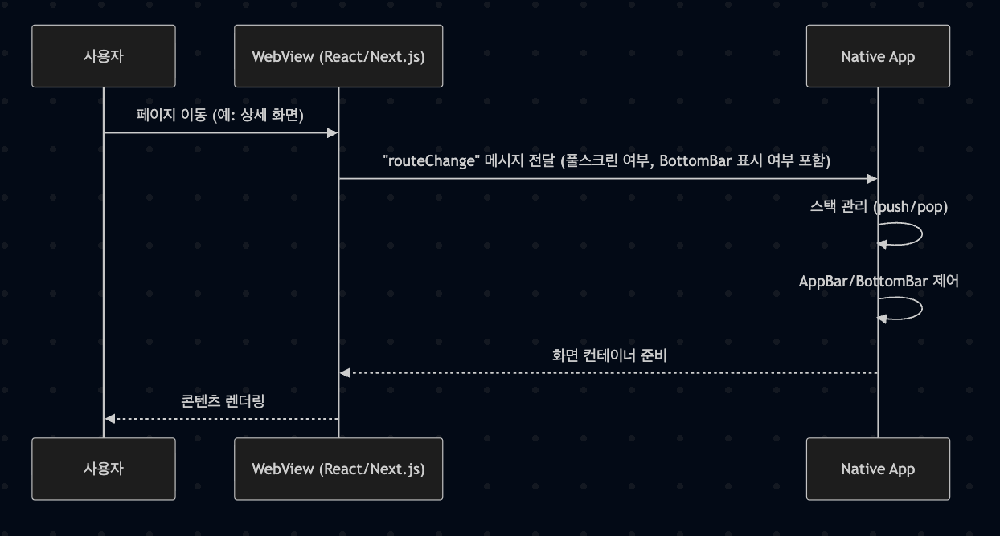
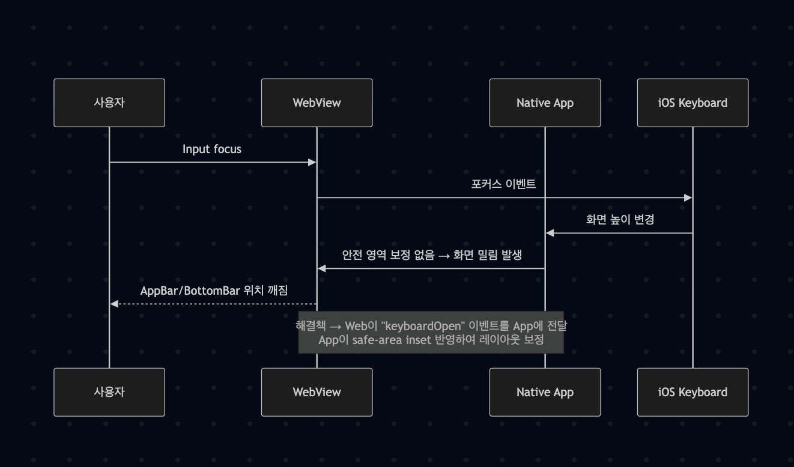

# WebView 개발 시 고려해야 할 사항들

## 1. 들어가며

WebView는 "웹을 앱 안에 넣을 수 있다"는 큰 장점 때문에 많은 서비스에서 선택하는 방식입니다. React/Next.js로 만든 화면을 WebView에 담으면 코드 재사용성과 앱 스토어 심사를 기다리는 동안에도 수정 사항을 빠르게 반영할 수 있습니다. 결과적으로 개발 속도와 배포 효율이 크게 향상됩니다. 하지만 막상 구현해 보면 네이티브 앱에서는 당연히 해결되는 부분들이 WebView에서는 직접 처리해야 하는 과제로 남습니다.

이번 글에서는 제가 WebView 기반 앱을 다루면서 부딪혔던 대표적인 이슈들 ― 네비게이션(AppBar/BottomBar), 페이지 스택, 스크롤/키보드 문제 ― 를 중심으로 어떤 원리로 발생하는지, 그리고 어떻게 해결할 수 있는지를 정리해 보겠습니다.

## 2. 네비게이션(AppBar/BottomBar) 제어

### 2.1 네이티브 앱과의 차이

**네이티브 앱:**
- 화면 전환 시 push → pop 스택 구조가 명확히 유지됨
- AppBar와 BottomBar의 노출 여부도 화면 단위로 일관되게 제어 가능

**WebView:**
- 브라우저 라우터 기반(history.pushState)으로 동작
- URL 이동만 관리할 뿐, 스택과 화면 속성 개념이 약함

### 2.2 문제 상황

1. **BottomBar 노출 문제**: 로그인 화면, 상세 페이지 등에서는 BottomBar가 사라져야 하는데 그대로 남아 있음
2. **뒤로 가기 충돌**: 뒤로 가기 버튼을 눌렀을 때, 웹의 history와 앱의 back stack이 충돌

### 2.3 해결 방법

```javascript
// Web에서 App으로 메시지 전달
window.ReactNativeWebView?.postMessage(JSON.stringify({
  type: 'NAVIGATION_UPDATE',
  data: {
    showBottomBar: false,
    showAppBar: true,
    isFullScreen: false
  }
}));
```

```javascript
// App에서 메시지 수신 및 처리
const onMessage = (event) => {
  const message = JSON.parse(event.nativeEvent.data);
  
  if (message.type === 'NAVIGATION_UPDATE') {
    const { showBottomBar, showAppBar, isFullScreen } = message.data;
    
    // AppBar/BottomBar 노출 여부 제어
    setBottomBarVisible(showBottomBar);
    setAppBarVisible(showAppBar);
    setFullScreenMode(isFullScreen);
  }
};
```

**해결 방법**: AppBar/BottomBar 노출 여부는 Web이 아니라 Native(App)가 최종적으로 제어해야 한다.

## 3. 페이지 스택과 라우터 주도권

### 3.1 왜 문제가 되나

1. **앱 종료 문제**: WebView 내부에서 단순히 `history.back()`만 호출하면 앱 전체가 종료되거나, 홈 화면으로 튀는 현상 발생
2. **중복 인스턴스**: 같은 URL 이동인데도 WebView 입장에서는 새로운 페이지 인스턴스로 쌓여 불필요한 중복 발생

### 3.2 라우터 주도권은 App이 가져야 한다

```javascript
// Web에서 페이지 이동 요청
const navigateToPage = (path) => {
  window.ReactNativeWebView?.postMessage(JSON.stringify({
    type: 'NAVIGATE',
    data: { path }
  }));
};

// Web에서 뒤로가기 요청
const goBack = () => {
  window.ReactNativeWebView?.postMessage(JSON.stringify({
    type: 'GO_BACK'
  }));
};
```

```javascript
// App에서 라우터 제어
const onMessage = (event) => {
  const message = JSON.parse(event.nativeEvent.data);
  
  switch (message.type) {
    case 'NAVIGATE':
      // App이 스택을 관리하고 WebView에 새로운 URL 로드
      navigationStack.push(message.data.path);
      webViewRef.current?.injectJavaScript(`
        window.history.pushState({}, '', '${message.data.path}');
        // 페이지 렌더링 로직 실행
      `);
      break;
      
    case 'GO_BACK':
      if (navigationStack.length > 1) {
        navigationStack.pop();
        const previousPath = navigationStack[navigationStack.length - 1];
        webViewRef.current?.injectJavaScript(`
          window.history.replaceState({}, '', '${previousPath}');
          // 이전 페이지 렌더링 로직 실행
        `);
      } else {
        // 앱 종료 또는 홈으로 이동
        BackHandler.exitApp();
      }
      break;
  }
};
```

**해결 방법**: 라우터의 주도권을 Web이 아닌 App이 가져야 한다. 이렇게 해야 WebView 특유의 불안정한 히스토리 문제를 피할 수 있습니다.

## 4. 스크롤과 키보드 이슈

### 4.1 iOS WebView

#### 문제점
- Input focus 시 화면이 위로 밀리면서 AppBar/BottomBar가 어긋남
- overscroll(바운스)로 레이아웃이 깨짐

#### 해결 방법

```html
<!-- viewport 설정 -->
<meta name="viewport" content="width=device-width, initial-scale=1.0, viewport-fit=cover">
```

```css
/* CSS에서 안전 영역 처리 */
body {
  overscroll-behavior: none;
  padding-bottom: env(safe-area-inset-bottom);
  padding-top: env(safe-area-inset-top);
}

/* 키보드 오픈 시 레이아웃 조정 */
.keyboard-open {
  padding-bottom: 0;
}
```

```javascript
// 키보드 이벤트 감지 및 App에 전달
const handleKeyboardOpen = () => {
  document.body.classList.add('keyboard-open');
  
  window.ReactNativeWebView?.postMessage(JSON.stringify({
    type: 'KEYBOARD_OPEN',
    data: { height: window.innerHeight }
  }));
};

const handleKeyboardClose = () => {
  document.body.classList.remove('keyboard-open');
  
  window.ReactNativeWebView?.postMessage(JSON.stringify({
    type: 'KEYBOARD_CLOSE'
  }));
};

// iOS에서 키보드 이벤트 감지
window.addEventListener('resize', () => {
  const height = window.innerHeight;
  if (height < window.screen.height * 0.75) {
    handleKeyboardOpen();
  } else {
    handleKeyboardClose();
  }
});
```

### 4.2 Android WebView

#### 문제점
- 소프트 키보드가 올라오면 입력창이 가려짐

#### 해결 방법

```javascript
// Android WebView 설정
const webViewConfig = {
  androidLayerType: 'hardware',
  domStorageEnabled: true,
  javaScriptEnabled: true,
  // 키보드 관련 설정
  keyboardDisplayRequiresUserAction: false,
  allowsInlineMediaPlayback: true,
  mediaPlaybackRequiresUserAction: false,
};
```

```javascript
// window.innerHeight 변화 감지로 레이아웃 재조정
let initialHeight = window.innerHeight;

const handleResize = () => {
  const currentHeight = window.innerHeight;
  const heightDifference = initialHeight - currentHeight;
  
  if (heightDifference > 150) { // 키보드가 올라온 것으로 판단
    // 입력창이 보이도록 스크롤 조정
    const activeElement = document.activeElement;
    if (activeElement && activeElement.scrollIntoView) {
      activeElement.scrollIntoView({ 
        behavior: 'smooth', 
        block: 'center' 
      });
    }
  }
};

window.addEventListener('resize', handleResize);
```

## 5. 성능과 UX 고려사항

### 5.1 메시지 통신 최적화

WebView는 네이티브보다 무겁고, Web ↔ App 간 메시지 전달 비용도 있습니다. 따라서 다음 원칙을 세워야 합니다:

1. **Web에서 해결 가능한 건 Web에서 끝내기** (예: 스크롤 처리)
2. **App에 이벤트를 전달하는 것은 꼭 필요한 경우로 최소화**
3. **메시지 프로토콜을 단순하게 유지**

```javascript
// 좋은 예: 필요한 경우만 메시지 전달
const handleNavigation = (path, options = {}) => {
  // Web에서 처리 가능한 경우
  if (options.withinWebView) {
    window.history.pushState({}, '', path);
    renderPage(path);
    return;
  }
  
  // App에 위임해야 하는 경우만 메시지 전달
  window.ReactNativeWebView?.postMessage(JSON.stringify({
    type: 'NAVIGATE',
    data: { path, ...options }
  }));
};

// 나쁜 예: 모든 이벤트를 App에 전달
const handleScroll = () => {
  // 스크롤은 Web에서 처리 가능하므로 App에 전달할 필요 없음
  window.ReactNativeWebView?.postMessage(JSON.stringify({
    type: 'SCROLL',
    data: { scrollY: window.scrollY }
  }));
};
```

### 5.2 메모리 관리

```javascript
// 컴포넌트 언마운트 시 이벤트 리스너 정리
useEffect(() => {
  const handleResize = () => {
    // 리사이즈 처리
  };
  
  window.addEventListener('resize', handleResize);
  
  return () => {
    window.removeEventListener('resize', handleResize);
  };
}, []);
```

### 5.3 로딩 최적화

```javascript
// 이미지 지연 로딩
const LazyImage = ({ src, alt }) => {
  const [loaded, setLoaded] = useState(false);
  
  useEffect(() => {
    const img = new Image();
    img.onload = () => setLoaded(true);
    img.src = src;
  }, [src]);
  
  return loaded ?  : <div className="placeholder" />;
};
```

## 6. 플랫폼별 특수 고려사항

### 6.1 iOS WebView 특수사항

```javascript
// iOS에서 터치 이벤트 최적화
const handleTouchStart = (e) => {
  e.preventDefault();
  // 터치 시작 처리
};

const handleTouchMove = (e) => {
  e.preventDefault();
  // 터치 이동 처리
};

// iOS에서 스크롤 바운스 방지
document.addEventListener('touchmove', (e) => {
  if (e.target.closest('.scrollable')) {
    return; // 스크롤 가능한 영역은 허용
  }
  e.preventDefault(); // 나머지는 방지
}, { passive: false });
```

### 6.2 Android WebView 특수사항

```javascript
// Android에서 하드웨어 가속 최적화
const optimizeForAndroid = () => {
  // CSS transform 사용으로 GPU 가속 활용
  const element = document.querySelector('.animated-element');
  element.style.transform = 'translateZ(0)';
  element.style.willChange = 'transform';
};

// Android에서 파일 업로드 처리
const handleFileUpload = () => {
  const input = document.createElement('input');
  input.type = 'file';
  input.accept = 'image/*';
  
  input.onchange = (e) => {
    const file = e.target.files[0];
    if (file) {
      // 파일을 Base64로 변환하여 App에 전달
      const reader = new FileReader();
      reader.onload = (event) => {
        window.ReactNativeWebView?.postMessage(JSON.stringify({
          type: 'FILE_UPLOAD',
          data: { 
            base64: event.target.result,
            fileName: file.name,
            fileType: file.type
          }
        }));
      };
      reader.readAsDataURL(file);
    }
  };
  
  input.click();
};
```

## 7. 디버깅과 모니터링

### 7.1 WebView 디버깅

```javascript
// 개발 환경에서 콘솔 로그를 App으로 전달
if (__DEV__) {
  const originalLog = console.log;
  console.log = (...args) => {
    originalLog(...args);
    window.ReactNativeWebView?.postMessage(JSON.stringify({
      type: 'CONSOLE_LOG',
      data: { message: args.join(' ') }
    }));
  };
}
```

### 7.2 에러 처리

```javascript
// 전역 에러 핸들러
window.addEventListener('error', (event) => {
  window.ReactNativeWebView?.postMessage(JSON.stringify({
    type: 'ERROR',
    data: {
      message: event.message,
      filename: event.filename,
      lineno: event.lineno,
      colno: event.colno
    }
  }));
});

// Promise rejection 핸들러
window.addEventListener('unhandledrejection', (event) => {
  window.ReactNativeWebView?.postMessage(JSON.stringify({
    type: 'PROMISE_REJECTION',
    data: {
      reason: event.reason?.toString() || 'Unknown error'
    }
  }));
});
```

## 8. 깨달은 점

1. **WebView는 단순히 웹을 담는 껍데기가 아니다**
   - 네이티브처럼 보이게 만들려면, Web과 App 사이에 명확한 역할 분리가 필요하다

2. **라우터 주도권은 App에 둬야 한다**
   - Web이 라우터를 직접 쥐면 AppBar/BottomBar, back 동작이 꼬이기 쉽다

3. **스크롤/키보드 이슈는 플랫폼별 대응이 필수다**
   - iOS와 Android의 WebView 동작 차이를 이해하지 못하면 UX가 크게 깨진다

4. **메시지 최소화와 단순화가 중요하다**
   - 브릿지 통신 비용이 있으므로, 필요 없는 이벤트 전달은 오히려 성능과 안정성을 해친다


## 9. 마무리

WebView는 빠른 개발과 코드 재사용성이라는 장점이 있지만, 네이티브처럼 동작하게 만드는 데는 별도의 노력이 필요합니다.

**핵심 체크포인트:**
- 네비게이션(AppBar/BottomBar) 제어
- 페이지 스택과 라우터 주도권
- 스크롤과 키보드 이슈
- 성능 및 UX 고려

이 네 가지는 반드시 점검해야 하는 핵심 포인트입니다.

이번 글은 제가 WebView를 다루면서 부딪힌 문제와 학습한 내용을 정리한 기록입니다. 
